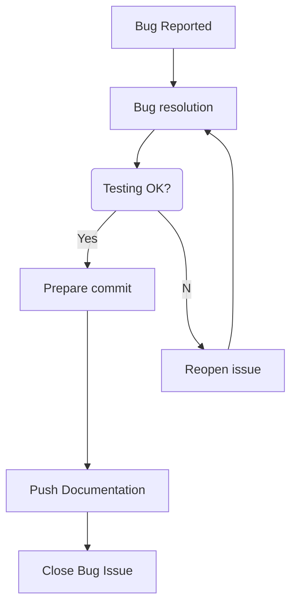
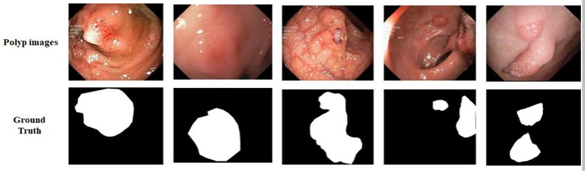
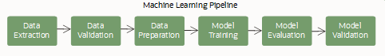

# Thursday 9th Nov 2023

## 11:00 -12:00 > Intro and preparations to hack
> Hacking: Intro the full AI pipeline and Setting GitHub repository: clone repo, GitHub workflow to code together and document as you hack

1. Setup your [Personal Access Token](https://docs.github.com/en/authentication/keeping-your-account-and-data-secure/managing-your-personal-access-tokens)
2. Clone repo
```
git clone https://github.com/SciKit-Surgery/cmicHACKS2.git 
```
3. Workflow for issue management 


## 13:00 - 15:00 > Get familiar with your data
> Get familiar with your data (download data, label data, etc.)



1. Download Kvasir-SEG dataset
> The Kvasir-SEG dataset (size 46.2 MB) contains 1000 polyp images and their corresponding ground truth from the Kvasir Dataset v2. 
> The resolution of the images contained in Kvasir-SEG varies from 332x487 to 1920x1072 pixels. 
> The images and its corresponding masks are stored in two separate folders with the same filename. 
> The image files are encoded using JPEG compression, and online browsing is facilitated. 
> The bounding box (coordinate points) for the corresponding images are stored in a JSON file.
https://datasets.simula.no/downloads/kvasir-seg.zip


2. Label data. 
See references for label tools

## 15:15 - 17:00 > Hacking: Training AI workflow
> Hacking: Training AI workflow   


* train Segmentation models
* convert `checkpoint.pth` to `colon.onnx"`

## References 

Jha, Debesh, Pia H. Smedsrud, Michael A. Riegler, Pål Halvorsen, Thomas de Lange, Dag Johansen, and Håvard D. Johansen, 
"Kvasir-seg: A segmented polyp dataset" 
Proceedings of the International Conference on Multimedia Modeling, pp. 451-462, 2020.
[google-citations](https://scholar.google.com/scholar?cites=15924410051330387241&as_sdt=2005&sciodt=0,5&hl=en)
[dataset](https://datasets.simula.no/kvasir-seg/)

Jha D, Ali S, Tomar NK, Johansen HD, Johansen D, Rittscher J, Riegler MA, Halvorsen P. 
Real-Time Polyp Detection, Localization and Segmentation in Colonoscopy Using Deep Learning
IEEE Access. 2021 Mar 4;9:40496-40510. doi: 10.1109/ACCESS.2021.3063716. PMID: 33747684; PMCID: PMC7968127.
[google-citations](https://scholar.google.com/scholar?cites=11882550127852592683&as_sdt=2005&sciodt=0,5&hl=en)

Label tools:   
* https://www.robots.ox.ac.uk/~vgg/software/via/  
* https://labelstud.io/  
* https://github.com/wkentaro/labelme
* https://github.com/opencv/cvat
* https://github.com/microsoft/VoTT

Other open datasets
* https://datasets.simula.no/ 
